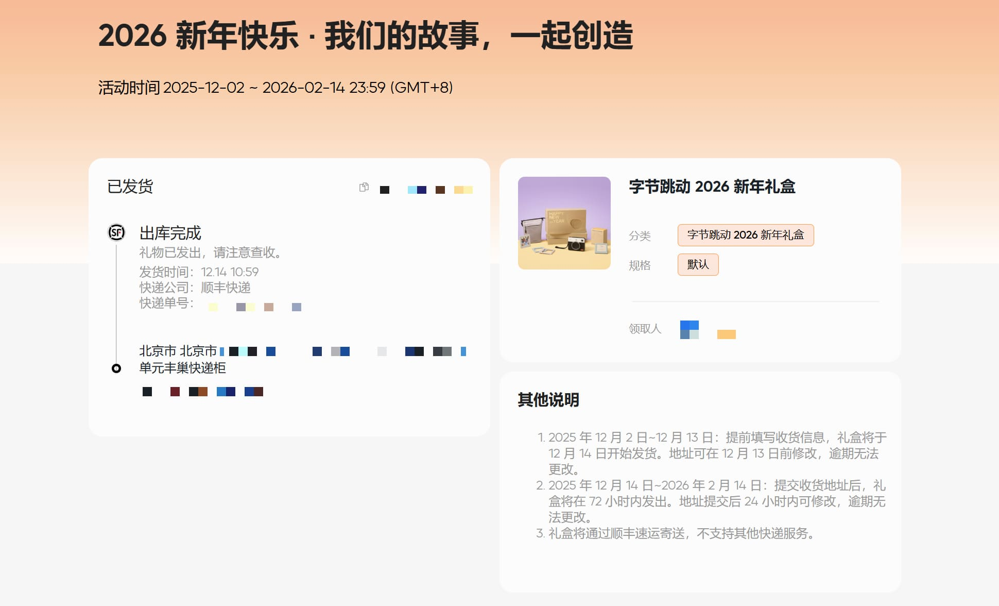

# 2025 年度总结

马上 25 年就结束了，留个总结吧，算是第一次正式的年度回顾：

**这一年过的其实挺累的，不过也充实**

## 年初目标

年初，给自己定了三个 Flag 🚩：

1. 孵化个人 IP

2. 创建个人博客

3. 开源一个项目（中后台快速开发脚手架）

现在看，貌似只有 1 和 2 达到了预期： 
统一了网名（Vespeng），开始在各大平台上活跃； 
博客站点也不错，干净整洁符合我的审美 😂，同时也沉淀了十多篇技术文章；
个人项目起初确实想简单了，平时除了处理工作和周六日不定期的社交，留给自己去开源的时间其实不多，一方面要维护个人博客，一方面还要不断的学习，附一下这一年的 GitHub 热力图：

这个 Flag 就留到 26 年去达成吧。

## 工作方面

工作上，一直苟在一个项目组，虽然组里边人员流动大，但好在我还算稳定，安安稳稳的度过了一年。
活干的多也杂，除了正常研发也做自动化测试等，技术上有了长足的进步。
工作状态也 OK，项目压力也都在自己的节奏中。

晒一下公司的新年礼品：

## 旅游

一年一次的旅游计划，今年去了 🏖️ 烟台：黄金海岸、养马岛、粉色沙滩...工作之余去放松下身心，留下些许美好的回忆。

## 未来展望

2026 年，博客当然是继续运营，输出更多优质的内容，同时全方位提升技术能力，期待新的一年能有更多惊喜。

---

> 作者: [Vespeng](https://github.com/vespeng/)  
> URL: https://vespeng.com/posts/2025_review/  

