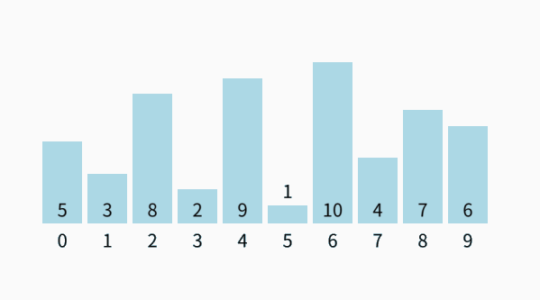

# 算法实现示例集：排序


排序是算法世界中最基础也最常用的操作之一，无论是面试准备、日常开发还是学习巩固，清晰可靠的排序算法实现都是程序员工具箱里的必备品。 

本文不追求冗长的理论推导，而是聚焦于提供清晰、可运行的核心代码实现。
<!--more-->

## 冒泡排序

冒泡排序的基本思路是通过重复遍历要排序的列表，比较相邻的两个元素，如果它们的顺序错误（即，前一个大于后一个），就交换它们的位置。遍历列表的工作会重复进行，直到没有需要交换的元素为止。

其时间复杂度是 \\(O(n^2)\\)，n 为数组的长度。

图解：


```go {data-open=true}
func bubbleSort(arr []int) {
    for i := 0; i < len(arr)-1; i++ {
        for j := 0; j < len(arr)-i-1; j++ {
			// 比较相邻元素，如果前一个元素大于后一个元素，则交换它们
            if arr[j] > arr[j+1] {
				arr[j], arr[j+1] = arr[j+1], arr[j]
            }
        }
    }
}
```

## 选择排序

选择排序的基本思路是每轮从未排序部分选择最小元素放到已排序部分的末尾，直到所有元素排序完成。

其时间复杂度是 \\(O(n^2)\\)，n 为数组的长度。

图解：



```go {data-open=true}
func selectionSort(arr []int) {
	for i := 0; i < len(arr)-1; i++ {
		minIndex := i
		for j := i + 1; j < len(arr); j++ {
			// 找到最小的元素索引
			if arr[j] < arr[minIndex] {
				// 更新最小元素索引
				minIndex = j
            }
        }
		// 交换元素
		arr[i], arr[minIndex] = arr[minIndex], arr[i]
    }
}
```

## 插入排序

插入排序的基本思路是将数组分为已排序部分和未排序部分，从未排序部分中取出一个元素，将其插入已排序部分的正确位置，直到所有元素排序完成。

其时间复杂度是 \\(O(n^2)\\)，n为数组的长度。

图解：


```go {data-open=true}
func insertionSort(arr []int) {
    for i := 1; i < len(arr); i++ {
        key := arr[i]
        j := i - 1
        // 将大于 key 的元素向后移动
        for j >= 0 && arr[j] > key {
            arr[j+1] = arr[j]
            j--
        }
		// 将 key 插入已排序部分的正确位置
		arr[j+1] = key
	}
}
```


---

> 作者: [Vespeng](https://github.com/vespeng/)  
> URL: https://vespeng.com/posts/algorithm_implementation_example_sort/  

