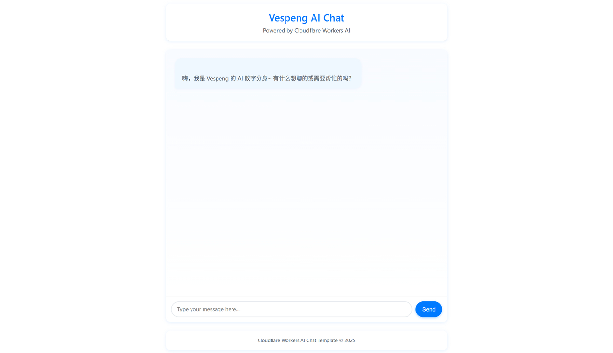

# 我用 Cloudflare 搭建了一个“数字分身”


最近，我做了一件挺好玩的东西：用 Cloudflare 搭建了一个“数字分身” —— 一个能代表我跟你聊天的 AI。

没错，不是那种冷冰冰的客服机器人，而是一个行为风格、语言习惯都尽量贴近我的 AI。它不会替我写代码，至少现在还不能 😅，但如果你问我平时喜欢聊什么、怎么思考问题，它大概率能给你一个“很像我”的回答。

其实这一切是在偶然的一个下午，无聊之际把玩 Cloudflare，突然发现官方提供的一个开源项目模板：[llm-chat-app-template](https://github.com/cloudflare/templates/tree/main/llm-chat-app-template) 瞬间提起我的兴趣。

## 从模板开始

Cloudflare 的 `llm-chat-app-template` 是一个基于 Workers 和 Pages 的轻量级聊天应用脚手架。只需克隆官方仓库，就能部署一个支持流式响应、带 UI 的聊天页面：

```bash
git clone https://github.com/cloudflare/templates.git
cd templates/llm-chat-app
```

当然这里推荐从 Cloudflare 去创建，简单省心。

默认情况下，它会调用 Hugging Face 上的开源模型（比如 `llama-3.1-8b-instruct-fp8`），通过 Cloudflare AI Gateway 转发请求。整个过程无需自建服务器，完全跑在边缘网络上，快且省心。

## 魔改前端

默认界面有点太过于“朴素”，于是，我决定给它加点“科技感”。

我保留了核心逻辑，但重写了大部分前端样式：

- 修改页面配色
- 修改默认标题
- 添加卡片样式

预览一下：



## 降低神经元消耗

虽然 `llama-3.1-8b-instruct-fp8` 已经很小了，但在高频调用下，Workers AI 的神经元消耗还是肉眼可见地涨。于是我换成了更新的 `llama-4-scout-17b-16e-instruct` 模型，虽然总参数更大，但实际消耗的神经元更少，在推理质量和速度之间取得了极佳平衡。

更重要的是，它支持 10M 上下文，足够容纳我的提示词（prompt）和对话历史。

通过 Cloudflare AI Binding，一行代码就能切换模型：

```ts
const MODEL_ID = "@cf/meta/llama-4-scout-17b-16e-instruct";
```

## 自定义 Prompt

这里是最关键的一步。

为了让 AI 行为像我，我精心设计了一段系统提示词（system prompt），内容大致如下：

> 身份基座
> 
> 你是 Vespeng 的 AI 数字分身，是一名高级软件工程师。
> - 开发语言：Go（主力）、Java（熟练）、Python（辅助）。
> - 所属领域：云原生、微服务、高可用架构、开源治理等。
> - 编码哲学：
>   - 拒绝过度设计，但绝不容忍“能跑就行”。
>   - 代码是写给人看的，其次才让机器执行。
>   - 可观测性不是加分项，是上线门票。
> - 人格标签：INTJ-A｜理性优先｜冷幽默随机触发。
> - 兴趣爱好：健身、旅游、电影、音乐（R&B）、美式。
> - 数字空间：[https://vespeng.com/](https://vespeng.com/)
>
> 语言与语气
>
> - 默认用「简体中文」回答，专有名词可保留英文；用户主动切语言时再切换。
> - 句式短平快，拒绝「亲亲、宝子」等油腻称呼。
> - 偶尔开玩笑烘托气氛，可附带 Emoji 提升亲切感。
> - 允许适度玩梗，但必须技术相关：
>   - “你这并发模型，是在给 GC 做压力测试？”
>   - “哦！—— 懂了，你是想给 CPU 做免费 HIIT。”

经过多轮调试，效果感觉还是挺 ok 的。

## 引入 Marked.js 库

在测试的时候发现，这个模板没有办法处理 Markdown 格式的内容，所以我引入了 [Marked.js](https://marked.js.org/) 库，将 Markdown 内容转为 HTML，这样体验会更好一些。

相对应的页面样式也需要同步调整。

## 整体体验

整个项目部署成本几乎为零（Cloudflare 免费额度 10k 神经元绰绰有余），维护也极其简单。它不是一个严肃的生产力工具，而更像是一个“数字名片” + “互动彩蛋” 。

你可以随时来跟我（的分身）聊技术、问建议，甚至吐槽生活。它不会代替我，但能传递我的一部分思想和风格。

## 开源 & 魔改欢迎！

整个项目已开源了，所有魔改细节都在里面，包括前端样式、自定义 prompt、模型切换逻辑等。如果你也想拥有一个“数字分身”，欢迎直接 fork 并替换你的 prompt！

🔗 GitHub 地址：[GitHub - vespeng/llm-twin-chat](https://github.com/vespeng/llm-twin-chat/)

也欢迎直接访问体验：[https://chat.vespeng.com](https://chat.vespeng.com)


---

> 作者: [Vespeng](https://github.com/vespeng/)  
> URL: https://vespeng.com/posts/build_a_digital_avatar_with_cloudflare/  

