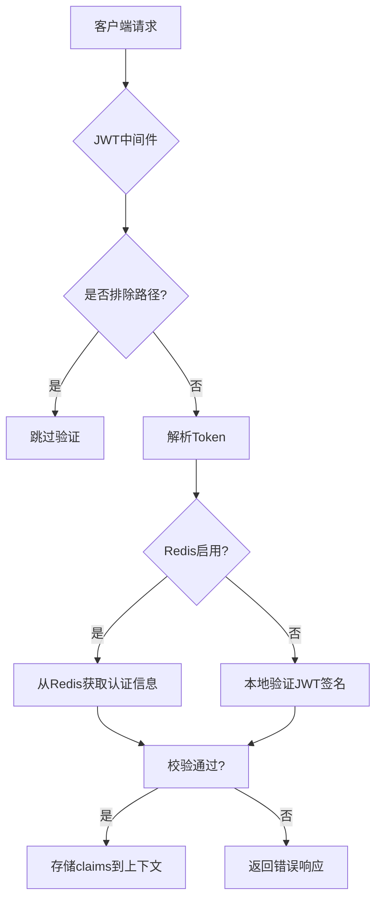

# Go 项目实战：实现 JWT 认证中间件


在构建安全可靠的 Go Web 服务时，JWT(JSON Web Token)认证是常用的解决方案。本文将介绍如何在 Gin 框架中实现完整的 JWT 认证方案，同时包含灵活的 Redis 集成选项。
<!--more-->
## 一、为什么需要 JWT 中间件

JWT 作为现代 Web 开发的认证标准，相比传统 cookie + session 方式有几个明显优势：

- **无状态性**：服务器不需要存储会话信息
- **跨域支持**：天然支持跨域认证
- **安全传输**：基于签名机制防止篡改
- **信息自包含**：Token 本身携带用户信息

在 Gin 框架中通过中间件实现 JWT 认证，可以统一处理认证逻辑，避免每个路由重复编写验证代码。

## 二、核心依赖包

开始前需要安装如下包：

```go
go get github.com/gin-gonic/gin
go get github.com/golang-jwt/jwt/v5
go get github.com/redis/go-redis/v9  # 可选，按需安装
```

## 三、实现方案设计

在实现 JWT 认证中间件时，我们的设计方案需要兼顾灵活性和安全性。整个流程可以分为几个关键步骤：

1.  **初始化配置**：从配置文件或环境变量中加载 JWT 的配置（如密钥、签发者、签名算法、过期时间等）。我们使用单例模式确保配置只加载一次，并通过互斥锁保证并发安全。
2.  **中间件流程**：
    - **排除特定路由**：对于不需要认证的路由（如登录、公开资源），直接跳过 JWT 验证。
    - **解析 Authorization 头**：从请求头中提取 Bearer Token，并验证其格式是否正确。
    - **验证 Token**：根据是否启用 Redis，采用不同的验证方式：
      - 如果启用了 Redis，首先尝试从 Redis 中获取该 Token 对应的声明（claims）。如果存在且有效，则直接使用；如果不存在或无效，则回退到JWT库的验证方式。
      - 如果没有启用 Redis，则直接使用 JWT 库验证 Token 的签名和有效期。
    - **处理验证结果**：如果验证通过，将 claims 存储到 Gin 的上下文中，供后续处理函数使用；如果验证失败，则根据具体的错误类型返回相应的错误信息。
3.  **Token 生成**：在用户登录成功后，生成 JWT Token。Token 中包含用户的身份信息（如用户ID和用户名）以及 JWT 的标准声明（如过期时间、签发者等）。如果启用了 Redis，还需要将 Token 和对应的声明存储到 Redis 中，并设置与Token相同的过期时间。
4.  **错误处理**：针对 JWT 验证过程中可能出现的错误（如 Token 过期、格式错误、签名无效等），提供清晰的错误信息，方便前端处理。
5.  **配置管理**：提供重置配置的功能，以便在需要时（如密钥轮换）重新加载配置。

为了更直观地理解上述流程，下面用一个流程图表示：



## 四、实战

### 1.配置结构定义

```go {data-open=true}
// JWT核心配置
type JWTConfig struct {
    Secret         []byte          		// 加密密钥 - 建议使用32字节安全随机数
    Issuer         string          		// 签发者 - 通常为服务名称
    SigningMethod  jwt.SigningMethod 	// 签名算法 - 支持HS256/HS384/HS512
    ExpirationTime time.Duration   		// 有效时长 - 如24h, 15m等
}

// 自定义Claims结构
type CustomClaims struct {
    UserID   int    `json:"userID"`   // 用户ID
    UserName string `json:"userName"` // 用户名
    jwt.RegisteredClaims              // JWT标准字段
}

// 全局配置实例（线程安全）
var (
    jwtConfig *JWTConfig
    mutex     sync.Mutex
)
```

### 2.JWT 中间件实现

```go {data-open=true}
func JwtMiddleware() gin.HandlerFunc {
    // 定义排除路径（支持通配符）
    excludedPaths := map[string]bool{
        "/api/v1/login":  true,
        "/public/*":      true,
        "/healthcheck":   true,
    }

    return func(c *gin.Context) {
        // 检查当前路径是否在排除列表中
        for path := range excludedPaths {
            if match, _ := filepath.Match(path, c.Request.URL.Path); match {
                c.Next() // 放行请求
                return
            }
        }

        // 获取Authorization头
        authHeader := c.GetHeader("Authorization")
        if authHeader == "" {
            c.AbortWithStatusJSON(http.StatusUnauthorized, gin.H{
                "code":    40101,
                "message": "Authorization header is required",
            })
            return
        }

        // 解析Bearer Token
        tokenString, err := parseBearerToken(authHeader)
        if err != nil {
            c.AbortWithStatusJSON(http.StatusUnauthorized, gin.H{
                "code":    40102,
                "message": "Invalid token format",
            })
            return
        }

        // 验证Token
        claims, err := validateJWT(tokenString)
        if err != nil {
            handleJWTError(c, err) // 处理各类验证错误
            return
        }

        // 存储claims到上下文（后续路由可通过c.Get("jwt_claims")获取）
        c.Set("jwt_claims", claims)
        c.Next()
    }
}
```

### 3.Token 生成

```go {data-open=true}
// 登录成功时调用
func GenerateToken(userID int, userName string) (string, error) {
    conf := config.LoadConfig() // 加载应用配置
    jwtConf, err := loadJwtConfig(conf)
    if err != nil {
        return "", fmt.Errorf("failed to load JWT config: %w", err)
    }

    // 创建Claims对象
    claims := CustomClaims{
        UserID:   userID,
        UserName: userName,
        RegisteredClaims: jwt.RegisteredClaims{
            ExpiresAt: jwt.NewNumericDate(time.Now().Add(jwtConf.ExpirationTime)),
            IssuedAt:  jwt.NewNumericDate(time.Now()),
            Issuer:    jwtConf.Issuer,
            // 可添加更多声明如：Subject, Audience等
        },
    }

    // 创建并签名Token
    token := jwt.NewWithClaims(jwtConf.SigningMethod, claims)
    tokenString, err := token.SignedString(jwtConf.Secret)
    if err != nil {
        return "", fmt.Errorf("failed to sign token: %w", err)
    }

    // 可选：当Redis启用时存储Token
    if conf.Redis.Enable {
        redisCli := redis.GetRedisCli() // 获取Redis连接
        defer redisCli.Close()

        // 序列化Claims
        claimsJSON, err := json.Marshal(claims)
        if err != nil {
            log.Printf("Failed to marshal claims: %v", err)
            // 不阻断流程，仅记录错误
        } else {
            // 存储到Redis，使用Token作为Key
            err = redisCli.Set(context.Background(), tokenString, claimsJSON, jwtConf.ExpirationTime).Err()
            if err != nil {
                log.Printf("Redis set error: %v", err)
            }
        }
    }
    
    return tokenString, nil
}
```

### 4.Token 验证逻辑

```go {data-open=true}
func validateJWT(tokenString string) (*CustomClaims, error) {
    conf := config.LoadConfig()
    // 优先从Redis获取（如果启用）
    if conf.Redis.Enable {
        redisCli := redis.GetRedisCli()
        defer redisCli.Close()

        // 尝试从Redis获取
        val, err := redisCli.Get(context.Background(), tokenString).Result()
        if err == nil {
            var claims CustomClaims
            if err := json.Unmarshal([]byte(val), &claims); err == nil {
                // 检查过期时间
                if claims.ExpiresAt != nil && claims.ExpiresAt.Before(time.Now()) {
                    return nil, jwt.ErrTokenExpired
                }
                return &claims, nil
            }
        }
        // Redis查找失败不影响后续流程
    }

    // JWT库验证
    token, err := jwt.ParseWithClaims(
        tokenString, 
        &CustomClaims{}, 
        func(token *jwt.Token) (interface{}, error) {
            // 验证签名算法是否匹配
            if token.Method != jwtConfig.SigningMethod {
                return nil, fmt.Errorf("unexpected signing method: %v", token.Header["alg"])
            }
            return jwtConfig.Secret, nil
        },
    )

    if err != nil {
        return nil, err
    }

    // 验证Claims结构
    if claims, ok := token.Claims.(*CustomClaims); ok && token.Valid {
        return claims, nil
    }
    
    return nil, jwt.ErrTokenInvalidClaims
}
```

### 5.错误处理机制

```go {data-open=true}
func handleJWTError(c *gin.Context, err error) {
    var errorResponse gin.H
    
    switch {
    case errors.Is(err, jwt.ErrTokenExpired):
        errorResponse = gin.H{
            "code":    40103,
            "message": "Token expired",
            "action":  "refresh_token",
        }
    case errors.Is(err, jwt.ErrTokenMalformed):
        errorResponse = gin.H{
            "code":    40104,
            "message": "Malformed token",
        }
    case errors.Is(err, jwt.ErrTokenSignatureInvalid):
        errorResponse = gin.H{
            "code":    40105,
            "message": "Invalid signature",
        }
    default:
        errorResponse = gin.H{
            "code":    40100,
            "message": "Authentication failed",
        }
    }
    
    c.AbortWithStatusJSON(http.StatusUnauthorized, errorResponse)
}
```

### 6.辅助函数实现

```go {data-open=true}
// Bearer Token解析
func parseBearerToken(header string) (string, error) {
    const bearerPrefix = "Bearer "
    if len(header) <= len(bearerPrefix) || !strings.HasPrefix(header, bearerPrefix) {
        return "", fmt.Errorf("authorization header format must be 'Bearer {token}'")
    }
    return strings.TrimSpace(header[len(bearerPrefix):]), nil
}

// 配置加载与初始化
func loadJwtConfig(conf *config.Config) (*JWTConfig, error) {
    mutex.Lock()
    defer mutex.Unlock()

    // 如果已初始化，直接返回
    if jwtConfig != nil {
        return jwtConfig, nil
    }

	// 生成32字节安全密钥
	b := make([]byte, 32)
    if _, err := rand.Read(b); err != nil {
        fmt.Println("failed to generate secure secret")
    }
	secret := base64.URLEncoding.EncodeToString(b)

    // 解析签名算法
    signingMethod := jwt.GetSigningMethod(conf.Jwt.SigningMethod)
    if signingMethod == nil {
        return nil, fmt.Errorf("invalid signing method")
    }

    // 解析过期时间
    expirationTime, err := time.ParseDuration(conf.Jwt.ExpirationTime)
    if err != nil {
        return nil, fmt.Errorf("invalid expiration format: %w", err)
    }

    // 创建配置实例
    jwtConfig = &JWTConfig{
        Secret:         secret,
        Issuer:         conf.Jwt.Issuer,
        SigningMethod:  signingMethod,
        ExpirationTime: expirationTime,
    }
    
    return jwtConfig, nil
}

// 重置配置（用于密钥轮换）
func ResetJWTConfig() {
    mutex.Lock()
    defer mutex.Unlock()
    jwtConfig = nil
}
```

### 7.config 配置文件

```ymal {data-open=true}
# config.yaml 示例

# redis配置
redis:
  enable: false                     # 是否启用 redis
  addr: localhost:6379
  password:
  db: 0

# jwt配置
jwt:
  issuer: vespeng                   # 签发者
  signingMethod: HS256              # 签名算法 (HS256、HS384、HS512)
  expirationTime: 30m               # 过期时间 (单位 min)
```

具体加载配置文件可参考 [Go 项目实战：搭建高效的 Gin Web 目录结构](https://vespeng.com/posts/go_practical_gin_directory_structure/#1%e9%85%8d%e7%bd%aeconfig)

## 五、在 Gin 路由中使用

```go {data-open=true}
func main() {
    r := gin.Default()

    // 应用全局JWT中间件
    r.Use(JwtMiddleware())

    // 登录路由（排除中间件）
    r.POST("/login", func(c *gin.Context) {
        // 1. 验证用户凭证（省略具体实现）
        user := authenticate(c.PostForm("username"), c.PostForm("password"))
        
        if user == nil {
            c.JSON(http.StatusUnauthorized, gin.H{"error": "Invalid credentials"})
            return
        }
        
        // 2. 生成JWT
        token, err := GenerateToken(user.ID, user.Name)
        if err != nil {
            c.JSON(http.StatusInternalServerError, gin.H{"error": "Token generation failed"})
            return
        }
        
        // 3. 返回响应
        c.JSON(http.StatusOK, gin.H{
            "token": token,
            "expires_in": int(jwtConfig.ExpirationTime.Seconds()),
        })
    })

    // 需要认证的路由
    authGroup := r.Group("/api")
    {
        authGroup.GET("/business", func(c *gin.Context) {
            // 从上下文获取claims
            rawClaims, exists := c.Get("jwt_claims")
            if !exists {
                c.JSON(http.StatusUnauthorized, gin.H{"error": "Claims not found"})
                return
            }
            
            // 类型断言
            claims, ok := rawClaims.(*CustomClaims)
            if !ok {
                c.JSON(http.StatusInternalServerError, gin.H{"error": "Invalid claims format"})
                return
            }
            
            // 返回用户信息
            c.JSON(http.StatusOK, gin.H{
                "user_id": claims.UserID,
                "username": claims.UserName,
            })
        })
        
        // 其他需要认证的路由...
    }

    // 启动服务
    r.Run(":8080")
}
```

以上实现方案既保证了安全性，又能保持代码的整洁和可维护性。根据实际业务需求，你可以灵活调整过期时间、签名算法等参数，以满足不同场景需求。


---

> 作者: [Vespeng](https://github.com/vespeng/)  
> URL: https://vespeng.com/posts/go_practice_implementing_jwt_auth_middleware/  

