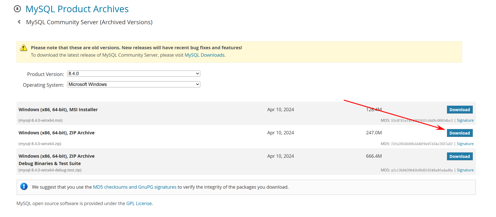

# MySQL 8.0 解压安装版配置文件及参数命令


## 下载地址

官网链接：[https://downloads.mysql.com/archives/community/](https://downloads.mysql.com/archives/community/)



## 配置文件

根目录下 `my.ini` 文件

```ini {data-open=true}
[mysqld]
# 设置MySQL服务的端口号，默认为3306
port=3306
# MySQL安装目录
basedir=D:\Env\mysql-8.4.0-winx64
# MySQL数据文件的存储目录，根据实际情况修改路径
datadir=D:\Env\mysql-8.4.0-winx64\data
# 设置MySQL使用的字符集，utf8mb4支持更多字符，建议使用
character-set-server=utf8mb4
# 设置默认的存储引擎，InnoDB是MySQL 8的默认且推荐的事务安全存储引擎
default-storage-engine=InnoDB
# 控制InnoDB存储引擎使用的内存大小，根据服务器内存情况调整，一般设置为物理内存的50% - 80%
innodb_buffer_pool_size = 1G
# 控制InnoDB数据文件的大小增长策略，每次自动扩展的大小
innodb_autoextend_increment = 64M
# 控制InnoDB存储引擎中日志文件的大小，影响事务处理性能和恢复时间
innodb_log_file_size = 256M
# 允许的最大连接数，根据服务器性能和预计并发访问量调整
max_connections = 200
# 允许单个查询使用的最大临时表大小，防止查询生成过大的临时表耗尽内存
max_heap_table_size = 64M
# 为了提高性能，可设置不区分大小写的表名（Windows系统下默认如此，Linux系统下需谨慎设置）
lower_case_table_names = 1

[mysql]
# 设置MySQL客户端默认使用的字符集，与服务器端保持一致
default-character-set=utf8mb4

[client]
# 设置MySQL客户端连接服务器时使用的端口号，需与服务器端配置一致
port=3306
# 设置MySQL客户端默认使用的字符集，与服务器端保持一致
default-character-set=utf8mb4
```
## 启动命令

> [!NOTE] 管理员身份运行，避免权限问题

```bash {data-open=true} 
# 初始化数据库 (随机 root 密码输出到控制台)
mysqld --initialize --console
# 安装服务
mysqld --install
# 启动服务
net start mysql
# 登录
mysql -u root -p
# 修改密码
alter user 'root'@'localhost' identified by '新密码';
# 刷新权限
flush privileges;
```


---

> 作者: [Vespeng](https://github.com/vespeng/)  
> URL: https://vespeng.com/posts/mysql_config_and_command/  

